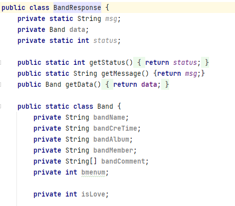

　　　

　

**《移动应用开发》实验报告**

**学年学期        2022-2023-02**        

**指导教师            陈鹏**                

**团队成员：2062410132黄强、2062410134吴海嘉、**

​		    	   **2062410115易博坤、2062410110祝星原**

# **目录**
[系统整体设计	3](#_toc137888497)

[前端界面设计	5](#_toc137888498)

[登录界面	6](#_toc137888499)

[注册界面	6](#_toc137888500)

[主界面	6](#_toc137888501)

[实现fragment之间的相互切换	6](#_toc137888502)

[fragment界面	6](#_toc137888503)

[详细信息界面	6](#_toc137888504)

[模型模块	5](#_toc137888505)

[整体模块架构	6](#_toc137888506)

[model功能类编写	6](#_toc137888507)

[定义后端返回数据字段	6](#_toc137888508)

[问题与收获	6](#_toc137888509)

[控制器模块	5](#_toc137888510)

[系统整体设计	6](#_toc137888511)

[整体模块架构	6](#_toc137888512)

[网络请求数据处理	6](#_toc137888513)

[页面更新	6](#_toc137888514)

[组件传值	6](#_toc137888515)

[本地存值	6](#_toc137888516)

[问题与收获	6](#_toc137888517)

[后端接口编写	5](#_toc137888518)

[api接口	5](#_toc137888519)

[接口测试	7](#_toc137888520)

[代码及部署	10](#_toc137888521)

# **系统整体设计**
易博坤经过前期技术调研，网络请求部分使用okHttp库，并验证可行性，封装简易的okHttpUtils类，配置AppConfig，设置网络请求的BaseUrl，自定义JsonUtils类，封装Gson插件，方便处理数据。明确MVC架构，分配团队任务。

黄强经过前期技术学习，网络请求选择使用okHttp库，编写通用get和post请求封装在OkHttpUtils类里，并负责设计编写model里的各个功能类，设计后端返回数据格式与方法，方便控制器进行数据实例化和获取返回数据。

吴海嘉负责UI界面设计，经过前期的需求分析，认为需要有以下页面：登录界面、注册界面、带底部导航栏的主界面以及可以显示选中项目细节的详情界面，下面是使用绘图工具制作的概念图：

登录界面

注册界面

主界面

# **前端界面设计**
吴海嘉负责前端界面的设计。
## **登录界面**
登录界面如下图所示

使用到的组件有三个textview文本，二个edittext文本框和两个按钮，采用linerlayout布局。当密码输入不符合基本要求时，会在登录界面弹出警告，点击登录按钮，若账户和密码正确，则会跳转到主界面，点击注册按钮，则会跳转至注册界面。

以下是它的布局

## **注册界面**

布局思路大致与登录界面相同，点击注册后会执行注册相关操作并跳转到登录界面。

## **主界面**
在主界面中，使用了fragment进行开发，Fragment 表示应用界面中可重复使用的一部分。fragment 定义和管理自己的布局，具有自己的生命周期，并且可以处理自己的输入事件。fragment 不能独立存在。它们必须由 activity 或其他 fragment 托管。fragment 的视图层次结构会成为宿主的视图层次结构的一部分，或附加到宿主的视图层次结构。

在主界面中，将屏幕区域划分为三块：最上面的工具栏显示一些提示信息，如现在选中的页面的名称，中间的container容器中存放着fragment组件，可以根据不同的选择进行切换，下面的导航栏放置了四个页面选项，对应了四种不同类型的数据：乐队、成员、演唱会以及用户个人信息。
## **实现fragment之间的相互切换**
关于导航栏具体功能的实现，这一部分主要在mainpage.activity文件中，当登录成功后，便开始生成页面，默认进入乐队界面。

下图所示的监听器监听的对象是导航栏上的四个按钮，根据监听到的值的不同可以确定用户按下了哪个按钮，然后根据按下的按钮切换到对应的fragment，实现导航栏的功能。

## **fragment界面**
fragment是一个相对独立的组件，它拥有着自己的布局文件，这里以乐队界面的fragment为例介绍一下。

本软件的fragment组件中布局比较简单，考虑到要实现的功能，里面只有一个listview组件，用于存放查询到的乐队的简略信息，当然，在activity文件中也定义了点击listview中某一个item后的具体反应：会跳转到一个显示选中的乐队的具体信息的页面，相关的代码如下所示：

## **详细信息界面**
不同类型的数据自然对应不同的详细信息，但实际上它们大同小异，还是以乐队的详细信息为例。

这个界面实现了展示选中的对象的详细信息的功能，同时还显示了已有的评论，评论是以scrollview的形式实现的，对于过多的评论，可以在一定的区域内上下滑动查看。

同时还实现了添加新的评论和关注与取关的功能。

# **模型模块**
黄强负责模型部分代码编写。
## **整体模块架构**
Utils部分建立OkHttpUtils类，引入OkHttp，定义其中的get和post请求方法，提供给模型使用，使model中不同功能类只用向后端发送不同url，不需要重复编写重复代码。其中get方法需要提供对应功能的url，创建request对象，传入url，再将request对象传入newcall方法构建回调call对象，最后将call对象加入队列，达到异步get请求效果。因为post需要发送数据给后端，而get只是从后端拉取数据，所以post请求比get请求多了携带信息的一步，不止url，还要传诸如“username”“bandname”的字符串，所以使用HashMap储存要发送的数据，规定储存的数据键名可以自定义，但值只能是String，将数据Json化之后构建request对象并发送。

model部分设计各种功能方法供控制模块调用，api中定义不同请求后端返回相应的数据的格式的类，并提供提取数据方法。

## **model功能类编写**
针对登录、注册、评论、关注、三种信息（乐队、成员、演唱会）的相关操作编写功能，这里以登录和乐队相关操作为例。

                      

首先定义通用的类成员变量和方法

设置监听器

乐队相关操作有获取所有乐队名称，查看某个乐队详情，关注、取关乐队，获取所有关注的乐队。

显然获取所有乐队名称不需要传数据（乐队名）给后端，所有用get请求。BASE\_URL代表固定前缀，封装在AppConfig里，不同的只有后面的“/getAllBand”字符串，这样后端收到整个url读取后部的字符串可以知道这个请求是何操作。后面是关于监听器的函数，存储了返回数据。

查看某个乐队详情需要用到post请求，发送乐队名字和用户名字给后端，这两个数据储存在hashmap里，作为参数传进post方法里。

获取用户所关注的乐队只用发送用户名即可。乐队model其他操作类似。

再看登录操作，同样先规定基本成员变量和方法。

传用户名和密码给后端，后端看到url中的login.do知道是登录操作。

其他功能代码类似，不过多赘述。
## **定义后端返回数据字段**
因为控制模块要对返回数据进行Json化方便逻辑操作，这样就要求对返回数据每个字段的类型都知道，所以在api中定义每个功能函数后端返回数据的类型。

比如定义获取所有乐队名称返回的数据类型，封装在BandListResponse里，除了固定的msg和status（后端返回文本和状态等），我们只要定义中间data里是String数组，因为返回多个bandName，储存在数组里。

查询乐队详细信息data数据格式则不同，因为含多个不同类型数据（String和int都有），需要自定义数据结构Band，Band里有成员变量bandName、bandMember、isLove等，还有获取他们的方法getBandName（）等等。

简单的返回数据则直接使用String类型即可，如登录请求返回的只有成功还是失败。

其他功能返回的数据字段类似，都进行了相似的定义，不多赘述。
## **问题与收获**
由于多个功能都用到get和post请求，所以后来想到把他封装在OkHttpUtils类里，提高代码复用率，并且一开始并没有使用Response来规定后端返回数据的格式，导致控制模块无法将数据转化为Json格式并获取，之后通过将response数据存入XXXXXResponse对象里，方便读取处理，model功能类里起初回调函数并不起作用，通过查询别人关于Http请求中回调函数的用法代码，发现创建callback对象代码出现错误后排除错误，通过此次移动应用的开发，我了解了MVC架构各个模块的联系与交互，并学到了很多方便快捷的操作，如引入各种现成的库，使用它们定义好的方法来完成自己的功能。
# **控制器模块**
易博坤负责控制器部分代码编写。
## **系统整体设计**
易博坤经过前期技术调研，网络请求部分使用okHttp库，并验证可行性，封装简易的okHttpUtils类，配置AppConfig，设置网络请求的BaseUrl，自定义JsonUtils类，封装Gson插件，方便处理数据。明确MVC架构，分配团队任务。

## **整体模块架构**
activity和fragment部分分别创建BasicActivity和BasicFragment，内部封装showToast、showToastSync和nagivateTo函数，提供给其他activity和fragment继承，提高代码复用性。

登录页后进入主页，主页下方有四个导航栏，乐队信息，成员信息，演唱会信息和关于我的，都用fragment编写，所有信息都通过ListView排列下来，点击每个item项可进入详细信息页面，这里用activity编写，如乐队详细信息BandDetailActivity、演唱会详细信息ConcertDetailActivity。
## **网络请求数据处理**
网络请求成功获取到的原数据是String类型，不经过处理无法使用，以获取乐队列表的网络请求为例。

这段代码使用JsonUtils类的fromJson()方法将服务器的响应（response）转换成一个BandResponse对象。

JsonUtils类是一个自定义的工具类，用于解析和转化数据格式。根据传入的字符串和类，使用Gson库将字符串转换为一个Java对象。

fromJson()方法接受两个参数：第一个参数是要解析的JSON字符串（response），第二个参数是要将JSON数据解析为的类类型（BandResponse.class）。此处的BandResponse是一个自定义的Java类，用于表示从服务器获取到的乐队响应数据。将解析后的BandResponse对象赋值给变量bandResponse。

之后，就可以调用bandResponse的内部方法获取到响应数据。

## **页面更新**
网络请求获取到数据后，需要将数据更新到页面上。

对于TextView设置值，根据对应xml文件对应TextView组件的id，通过findViewById获取到TextView实例。

使用setText方法设置值。

需要注意的是，需要在网络请求的回调中设置文本值，而在Android应用程序中，非UI线程不允许直接更新UI组件，如果多个线程同时更新UI组件，可能会导致应用程序崩溃或发生其他异常。网络请求运行在子线程，在回调函数中直接使用setText会导致程序崩溃，需要使用Handler类发布到UI线程上执行，handler.post(() -> {…}) 是在UI线程上更新UI组件的操作，使得内部的更新UI组件的操作在UI线程上异步执行。

对于ListView类型的列表设置文本，使用适配器更新页面。

这段代码是将从服务器获取到的乐队评论数据（Data.getBandComment()）存储在一个List集合中，然后将该集合作为适配器(ArrayAdapter)的数据源，更新在列表视图(ListView)中展示评论数据。

首先，将乐队评论数据(Data.getBandComment())存储在一个List对象(commentList)中，Arrays.asList()是将数组转换为集合的方法。接着，将适配器(ArrayAdapter)的构造函数中传入：getApplication()作为上下文，android.R.layout.simplelistitem\_1是内置的列表项布局，commentList是存储在适配器中的数据源。然后，使用commentLayout.setAdapter(adapter)方法，将适配器设置到列表视图中(commentLayout)。

适配器是一个将数据显示在视图上的桥梁，用于将数据和UI组件进行绑定。以上代码，适配器会将存储在commentList中的乐队评论数据填充到列表视图中，展示出乐队评论的内容。
## **组件传值**
当点击列表项的具体值，进入这个列表项的详细页面，即从fragment组件跳转到activity页面，以点击乐队列表项跳转到其详细页面为例，是BandFragment跳转到BandDetailActivity，当跳转到BandDetailActivity，这个组件在创建时需要根据传递过来的bandName发送网络请求，获取该乐队的详细信息，更新到页面上。需要监控ListView项的点击事件，通过intent进行传值。

创建一个Intent对象，并通过参数传入当前Fragment所属的Activity（getActivity()）和目标Activity（BandDetailActivity.class）的Class类型。将乐队名字（bandName）通过putExtra()方法添加为额外参数，然后调用startActivity()方法启动目标Activity（BandDetailActivity）。

在BandDetailActivity中，可以通过getIntent().getStringExtra(“bandName”)获取传递过来的乐队名字，发送网络请求。
## **本地存值**
使用SharedPreferences将用户登录成功后的username保存在本地，获取我喜欢的乐队需要发送用户的username。

登录成功后以键值对的形式保存，可以在应用程序中方便地读取和写入数据。

需要获取时，使用getString()，第一个参数是存储的键名，第二个参数为默认值，如果找不到指定键名的值，getString() 方法将返回默认值。

## **问题与收获**
在本地验证网络请求时，搭建了本地服务在http://localhost:5000/api/xxx，将BaseUrl设置成http://localhost:5000，但是发送网络请求时却无效，后来了解到 localhost 是一个特殊的域名，指代的是本地主机，而 Android 设备并不是在本地主机上运行的，而是在移动设备上运行的，可以使用特殊的 IP 地址 10.0.2.2 来代替 localhost。这是因为 Android 模拟器的网络堆栈会将访问这个 IP 地址的请求路由到本地主机上，而不是发到网络。

在Android应用程序中，非UI线程不允许直接更新UI组件，这是因为UI组件不是线程安全的，如果多个线程同时更新UI组件，可能会导致应用程序崩溃或发生其他异常。

在Android中，更新UI组件的操作必须在UI线程（也称为主线程）上执行。如果在非UI线程上执行更新UI组件的操作，需要将该操作发布到UI线程上执行，通常有以下两种方式：

一种方式是使用Handler类或者Looper类将更新UI组件的操作封装成一个Runnable对象，然后将该对象发布到UI线程的消息队列中，使其在UI线程上执行。

另一种方式是使用AsyncTask类，该类提供了方便的方法用于在异步任务后台线程中执行耗时操作，并在UI线程上更新UI组件。AsyncTask内部会自动将UI更新操作发布到UI线程的消息队列中。
# **后端接口编写**
祝星原负责后端接口部分的编写。

后端部分采用Springboot框架整合Mybatis，使用MySQL数据库，部署在阿里云ECS服务器上。
## **api接口**

http://47.115.216.16:8080

查询所有乐队

/getAllBand

查询喜欢的乐队

/getLoveBand

{"username":"user1"}

查询乐队详情

/getBandInfo

{"bandName":"Beyond"}

关注乐队

/followBand

{"username":"user1","bandName":"Beyond"}

取消关注乐队

/unfollowBand

{"username":"user1","bandName":"Beyond"}

评论乐队

/commentBand

{"bandName":"Beyond","comment":"2"}

评论乐队成员

/commentMember

{"memberName":"黄家驹","comment":"2"}

评论演唱会

/commentPerform

{"performName":"2018冬CM","comment":"2"}

查询成员详情

/getMemberInfo

{"memberName":"黄家驹"}

查询演唱会详情

/getPerformInfo

{"performName":"2018冬CM"}

查询演唱会列表

/getAllPerform

查询歌手列表

/getAllMember
## **接口测试**
登陆接口                                  注册接口

 

查询喜欢的乐队

查询乐队详情

关注乐队

取消关注乐队

查询所有乐队

评论乐队  评论乐队成员

评论演唱会

查询成员详情 查询演唱会详情

 

查询演唱会列表  查询歌手列表

## **代码及部署**
在服务器上启动springboot项目

Navicat远程连接到mysql数据库

整体架构

UserController.java

Dao层

Service层

